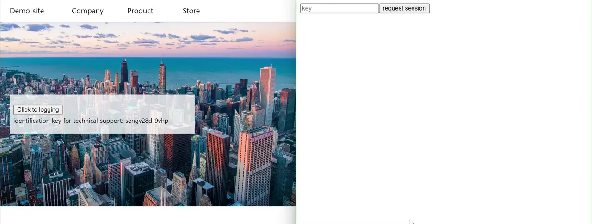

# pseudo-control

[한국어(Korean)](README.ko-KR.md)

Remove `technical support access` settings from your product.

pseudo-control implements WebRTC-based Web Client screen remote control, so it is no longer necessary to create a "authorized" backdoor for technical support for web applications.

## Features
- Remote control without installing any program for the customers' technical support requests in Web application.
- Mouse DOM events such as click and hover can be executed on the screen.
- If you track specific events, such as error handling, in the source code in advance, you can provide more information to the participating in remote control.

### Feature Roadmap
These functions are not provided at this stage, as they must be accompanied by a hosted Backend implementation and the establishment of an accredited organization. If you are interested in those features, please contact us at pseudocontrol@pseudoarticle.com.

- Verify the real-time end-to-end integrity of the script and data
- Run JavaScript code with the user's approval
- Remote control session recording for auditing
- Capture network activity

## Documentation
- [Client](pseudo-control-client/README.md)
- [Manager](pseudo-control-manager/README.md)
- [Server](pseudo-control-server/README.md)

## License
[MIT License](LICENSE)
